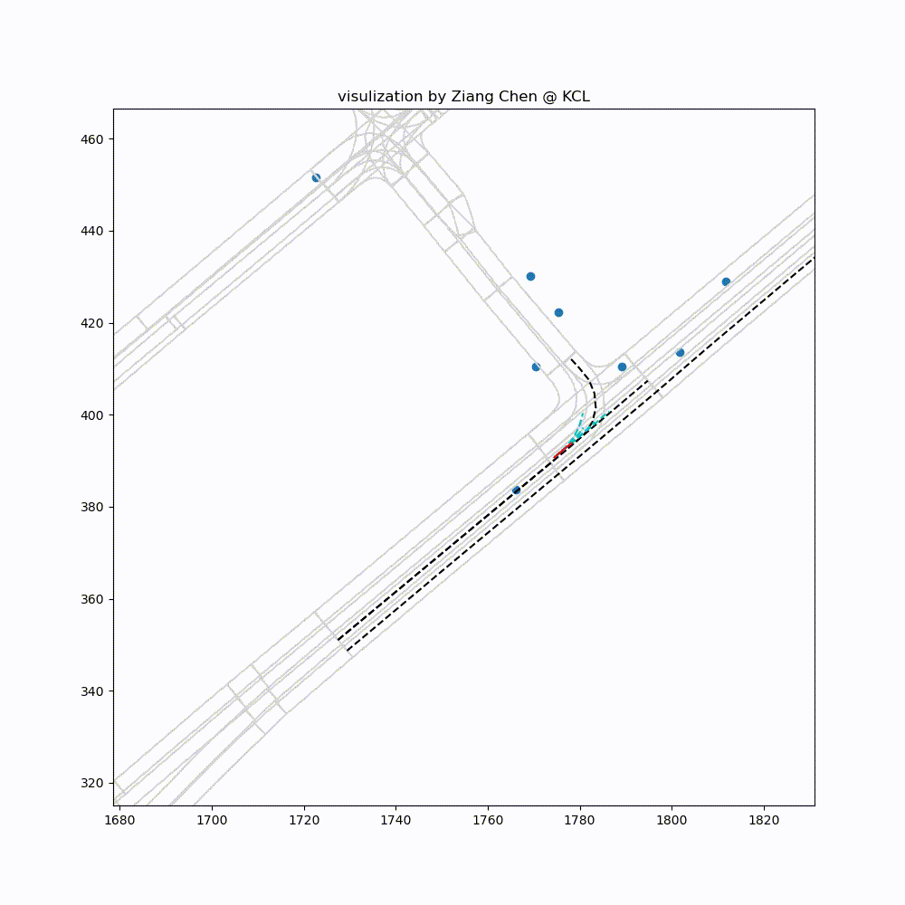
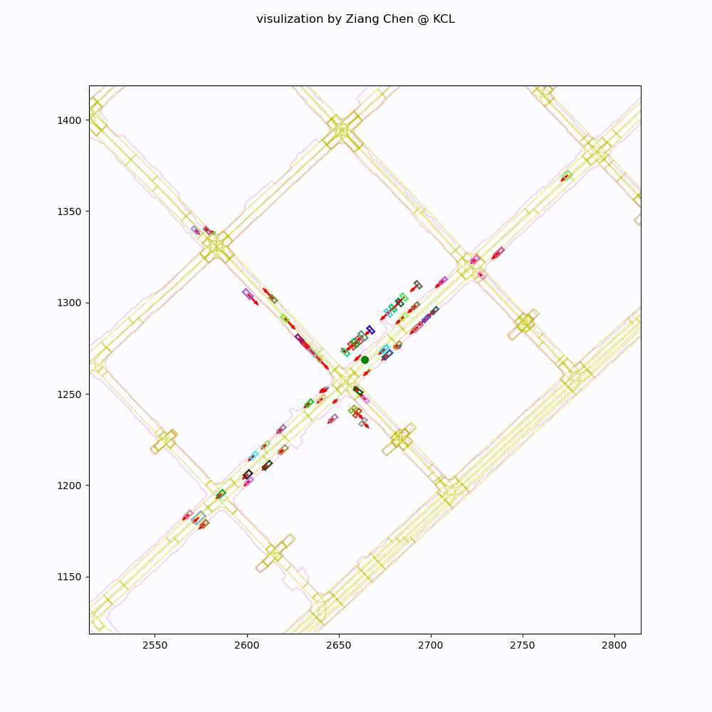

# Trajectory Forecasting Visulization

Ziang Chen @ KCL


CopyRight Reserved


## About

This code is based on the real-world project, modified and removed following part for intellectual property protect:

* Model Training 
* Priviate Dataset API
* User interface in CLI & GUI

I put the model output result in a dump file 

```bash
model_output.pll
```

To runing the project, configurated the right path in *config.py*

Download the open source data and install MAP API in 

https://www.argoverse.org/


Put to the coressponding floder


Finally build the neccessary depnedency by

```bash
conda install pytorch torchvision torchaudio cudatoolkit=11.3 -c pytorch
conda install pandas numpy tqdm
```

Package Frame to video by running
```bash
ffmpeg -i %d.jpg name.mp4
```

## Result





